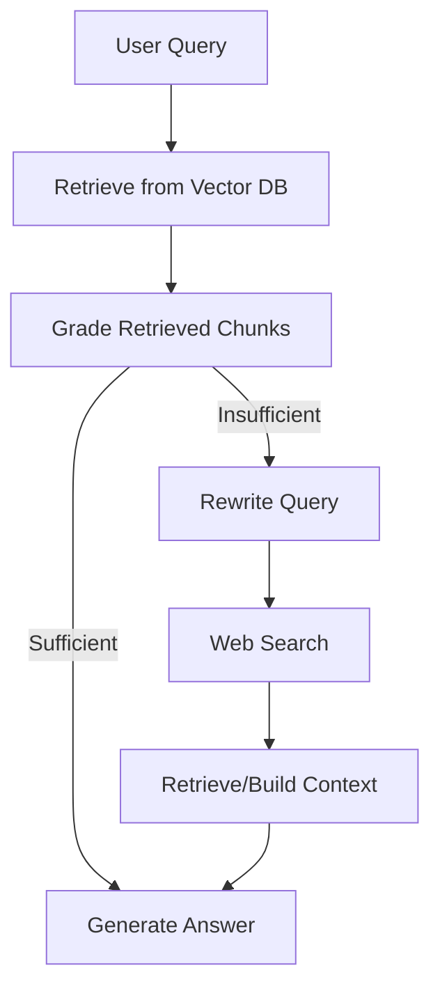

# Agentic Corrective RAG System with LangGraph

An **Agentic Corrective Retrieval-Augmented Generation (CRAG)** pipeline built with **LangGraph** for domain QA over Vietnamese documents (e.g., YHCT).  
The system can **self-check retrieved context** and **fallback to query rewrite + web search** when local evidence is insufficient.

---

## Open in Colab (Quickstart)

> Open a notebook and run **Runtime → Run all**.

<p align="left">
  <a href="https://colab.research.google.com/drive/1-Hh52dIAnHE3QWzUYlKtvuf7IR0zksHY?usp=sharing">
    
  </a>
  <a href="https://colab.research.google.com/drive/1wVzP8nj3-0neq_pLkIkpEs_Od8Tu-3xC?usp=sharing">
    
  </a>
  <a href="https://colab.research.google.com/drive/1piGvJVQpZPkwQPVOrHqhCsKCS3QybEkX?usp=sharing">
    
  </a>
</p>

---

## Table of Contents

- [Agentic Corrective RAG System with LangGraph](#agentic-corrective-rag-system-with-langgraph)
  - [Open in Colab (Quickstart)](#open-in-colab-quickstart)
  - [Table of Contents](#table-of-contents)
  - [Overview](#overview)
  - [System Pipeline](#system-pipeline)
  - [Models \& Tools](#models--tools)
  - [Installation](#installation)
    - [Option A — Colab (Recommended)](#option-a--colab-recommended)
    - [Option B — Local (Jupyter / Python)](#option-b--local-jupyter--python)
  - [Data Setup](#data-setup)
    - [Example (as used in the notebooks)](#example-as-used-in-the-notebooks)
  - [Run on Colab](#run-on-colab)
  - [Run Locally](#run-locally)
  - [Evaluation](#evaluation)
  - [Outputs](#outputs)
  - [Troubleshooting](#troubleshooting)
  - [Acknowledgements](#acknowledgements)

---

## Overview

This project implements an **agentic CRAG** workflow:

- Retrieve relevant chunks from a **local vector database**
- Grade retrieved evidence
- If evidence is good → answer
- If evidence is weak → rewrite query and/or use **web search** → answer

The goal is to reduce hallucinations and improve answer grounding.

---

## System Pipeline



---

## Models & Tools

The default notebooks use:

- **Embedding model:** `BAAI/bge-m3`
- **Reranker:** `BAAI/bge-reranker-base`
- **LLM (generation / judge):** `Qwen/Qwen2.5-7B-Instruct`
- **Vector store:** ChromaDB
- **Web search:** DuckDuckGo (via `duckduckgo-search` / `ddgs`)

> You can swap models by editing the corresponding cells/config inside the notebook.

---

## Installation

### Option A — Colab (Recommended)
No local setup needed. Use one of the Colab notebooks above.

### Option B — Local (Jupyter / Python)
Install dependencies (minimum set used in notebooks):

```bash
pip install -U \
  langchain langchain-community langchain-core langgraph \
  langchain-openai langchain-huggingface \
  langchain-chroma chromadb \
  sentence-transformers \
  duckduckgo-search ddgs \
  docx2txt pandas openpyxl
```

> If your environment differs, follow the install cell in the notebook as the source of truth.

---

## Data Setup

The notebooks expect:

1. **Knowledge documents**: typically `.docx` files (domain corpus)
2. **Evaluation set**: a `.json` file containing questions and ground-truth answers

### Example (as used in the notebooks)
- Domain docs (`.docx`): internal medicine / pediatrics / ENT (YHCT) documents
- Evaluation JSON: a QA file (e.g., “bệnh ngũ quan.json”)

**On Colab**
- Mount Google Drive:
  - `from google.colab import drive`
  - `drive.mount('/content/drive')`
- Update file paths to your Drive location.

**On Local**
- Put files under a folder like `data/`
- Update paths in the notebook cells accordingly.

---

## Run on Colab

1. Open a notebook (badge above)
2. **Mount Google Drive** (if using Drive files)
3. Run the notebook top-to-bottom:
   - Install libs
   - Load + chunk documents
   - Build/load the Chroma vector DB
   - Run a demo query
   - (Optional) Run evaluation

---

## Run Locally

1. Install dependencies (see [Installation](#installation))
2. Open the notebook with Jupyter / VSCode:
   - Run all cells sequentially
3. Ensure:
   - Document paths are correct
   - Chroma persistence directory is writable (if enabled)
   - Optional: run on GPU for faster inference

---

## Evaluation

The evaluation section compares (as implemented in the notebooks):

1. **Agentic CRAG** (with rewrite + web search fallback)
2. **CRAG without web search** (local retrieval + grading only)
3. **Naive RAG** baseline

A judge LLM scores each answer with criteria such as:
- **Faithfulness** (groundedness vs. context)
- **Relevance**
- **Correctness** (vs. ground truth)

> Web-search is inherently non-deterministic; results can vary over time.

---

## Outputs

After evaluation, results are saved as Excel files:

- `agentic_crag_results.xlsx`
- `crag_result.xlsx`
- `naive_rag_results.xlsx`

Each file typically includes per-question scores (and may include generated answers depending on the notebook version).

---

## Troubleshooting

- **Slow / OOM**
  - Use a GPU runtime (Colab GPU recommended)
  - Reduce generation max tokens / batch size
- **Poor retrieval**
  - Tune chunk size / overlap
  - Increase top-k and tighten grading thresholds
  - Switch embedding model
- **Web search noise**
  - Trigger web search only when grading is low
  - Log retrieved sources and adjust filtering rules

---

## Acknowledgements

- LangGraph / LangChain ecosystem
- BAAI embedding + reranker models
- Qwen open-source LLM family
- DuckDuckGo search tooling
