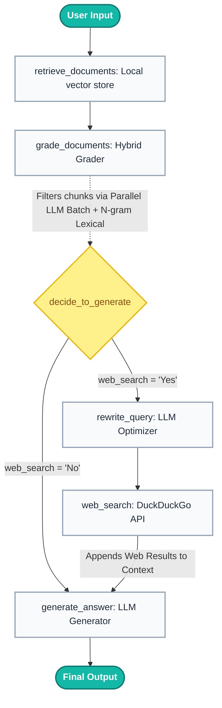

# Agentic Corrective RAG System with LangGraph

<p align="left">
  
  
  
  
  
  
</p>

An **Agentic Corrective Retrieval-Augmented Generation (CRAG)** pipeline built with **LangGraph** for domain QA over Vietnamese documents (e.g., YHCT).  
The system can **self-check retrieved context** and **fallback to query rewrite + web search** when local evidence is insufficient.

---

## Open in Colab (Quickstart)

> Open a notebook and run **Runtime → Run all**.

<p align="left">
  <a href="https://colab.research.google.com/drive/1-Hh52dIAnHE3QWzUYlKtvuf7IR0zksHY?usp=sharing">
    
  </a>
  <a href="https://colab.research.google.com/drive/1wVzP8nj3-0neq_pLkIkpEs_Od8Tu-3xC?usp=sharing">
    
  </a>
  <a href="https://colab.research.google.com/drive/1piGvJVQpZPkwQPVOrHqhCsKCS3QybEkX?usp=sharing">
    
  </a>
</p>

---

## Table of Contents

- [Agentic Corrective RAG System with LangGraph](#agentic-corrective-rag-system-with-langgraph)
  - [Open in Colab (Quickstart)](#open-in-colab-quickstart)
  - [Table of Contents](#table-of-contents)
  - [Overview](#overview)
  - [System Pipeline](#system-pipeline)
  - [Models \& Tools](#models--tools)
  - [Installation](#installation)
    - [Option A — Colab (Recommended)](#option-a--colab-recommended)
    - [Option B — Local (Jupyter / Python)](#option-b--local-jupyter--python)
  - [Data Setup](#data-setup)
    - [Example (as used in the notebooks)](#example-as-used-in-the-notebooks)
  - [Run on Colab](#run-on-colab)
  - [Run Locally](#run-locally)
  - [Evaluation](#evaluation)
  - [Outputs](#outputs)
  - [Troubleshooting](#troubleshooting)
  - [Acknowledgements](#acknowledgements)

---

## Overview

This project implements an **agentic CRAG** workflow:

- Retrieve relevant chunks from a **local vector database**
- Grade retrieved evidence
- If evidence is good → answer
- If evidence is weak → rewrite query and/or use **web search** → answer

The goal is to reduce hallucinations and improve answer grounding.

---

## System Pipeline


```mermaid
graph TD
    %% Nodes
    Start([User Input])
    Retrieve[retrieve_documents: Local vector store]
    Grade[grade_documents: Hybrid Grader]
    Decide{decide_to_generate}
    Rewrite[rewrite_query: LLM Optimizer]
    Search[web_search: DuckDuckGo API]
    Generate[generate_answer: LLM Generator]
    End([Final Output])

    %% Edges
    Start --> Retrieve
    Retrieve --> Grade
    
    %% Internal logic description
    Grade -.->|Filters chunks via Parallel LLM Batch + N-gram Lexical| Decide

    Decide -->|web_search = 'No'| Generate
    Decide -->|web_search = 'Yes'| Rewrite
    
    Rewrite --> Search
    Search -->|Appends Web Results to Context| Generate
    
    Generate --> End
    
    %% Styling
    classDef startend fill:#14b8a6,stroke:#0f766e,stroke-width:2px,color:#fff,font-weight:bold;
    classDef process fill:#f8fafc,stroke:#94a3b8,stroke-width:2px,color:#1e293b;
    classDef condition fill:#fef08a,stroke:#eab308,stroke-width:2px,color:#854d0e;
    
    class Start,End startend;
    class Retrieve,Grade,Rewrite,Search,Generate process;
    class Decide condition;
```

---

## Models & Tools

The system defaults are optimized for speed and accuracy in Vietnamese:

- **Embedding model:** `keepitreal/vietnamese-sbert` (Lightweight, CPU-friendly, optimized for Vietnamese semantic search).
- **LLM (Generation / Judge):** Configurable API chain prioritizing **Groq (Llama-3.1-8b-instant)** for ultra-fast generation, falling back to Cerebras, Mistral, and OpenRouter.
- **Retrieval Logic:** Hybrid search combining semantic embeddings with strict **N-gram Lexical Search** to accurately retrieve YHCT medical terms.
- **Reranker:** Disabled by default for speed, but supports `BAAI/bge-reranker-base`.
- **Vector store:** In-memory store (or ChromaDB).
- **Web search:** DuckDuckGo (via `duckduckgo-search` / `ddgs`).

> You can swap models by editing the `.env` file or `config.py`.

---

## Installation

### Option A — Colab (Recommended)
No local setup needed. Use one of the Colab notebooks above.

### Option B — Local (Jupyter / Python)
Install dependencies (minimum set used in notebooks):

```bash
pip install -U \
  langchain langchain-community langchain-core langgraph \
  langchain-openai langchain-huggingface \
  langchain-chroma chromadb \
  sentence-transformers \
  duckduckgo-search ddgs \
  docx2txt pandas openpyxl
```

> If your environment differs, follow the install cell in the notebook as the source of truth.

---

## Data Setup

The notebooks expect:

1. **Knowledge documents**: typically `.docx` files (domain corpus)
2. **Evaluation set**: a `.json` file containing questions and ground-truth answers

### Example (as used in the notebooks)
- Domain docs (`.docx`): internal medicine / pediatrics / ENT (YHCT) documents
- Evaluation JSON: a QA file (e.g., “bệnh ngũ quan.json”)

**On Colab**
- Mount Google Drive:
  - `from google.colab import drive`
  - `drive.mount('/content/drive')`
- Update file paths to your Drive location.

**On Local**
- Put built-in files under `Data/`
- Update paths in the notebook cells accordingly.


---

## Project Structure

```text
Agentic-CRAG/
|-- app.py                    # Thin Gradio launcher; run with python app.py
|-- main.py                   # CLI/demo entrypoint
|-- pyproject.toml            # Python package metadata
|-- modules/
|   |-- settings.py           # Environment, paths, retrieval parameters
|   |-- models.py             # Embedding and API LLM loaders
|   |-- ingestion/
|   |   |-- loaders.py        # .docx/.txt/.md loading and text cleanup
|   |   |-- sources.py        # Built-in/uploaded source inventory and soft-delete
|   |   `-- splitters.py      # Book-specific and generic chunking
|   |-- retrieval/
|   |   |-- retriever.py      # In-memory hybrid retriever and source diversification
|   |   `-- vector_store.py   # Chroma/in-memory vector store factory
|   |-- rag/
|   |   |-- chains.py         # Grader, rewriter, generator chains
|   |   |-- graph.py          # LangGraph CRAG workflow
|   |   |-- service.py        # Application service layer for graph/index operations
|   |   `-- ingestion.py      # Backward-compatible facade
|   |-- ui/
|   |   |-- formatting.py     # Answer/source formatting and citations
|   |   |-- handlers.py       # Chat, upload, delete, rebuild handlers
|   |   `-- gradio_app.py     # Gradio layout and launch
|   |-- components.py         # Backward-compatible wrapper for modules.rag.chains
|   |-- graph.py              # Backward-compatible wrapper for modules.rag.graph
|   `-- ingestion.py          # Backward-compatible wrapper for modules.rag.ingestion
|-- Data/                     # Built-in source documents
|-- user_sources/             # User-uploaded source documents
|-- database/                 # Chroma/vector database directory
|-- config.py                 # Backward-compatible wrapper for modules.settings
`-- utils.py                  # Backward-compatible wrapper for modules.models
```

The canonical implementation now lives under `modules/`. Root-level `app.py`, `config.py`, and `utils.py` remain as compatibility entrypoints/wrappers so older commands keep working.

---

## Run on Colab

1. Open a notebook (badge above)
2. **Mount Google Drive** (if using Drive files)
3. Run the notebook top-to-bottom:
   - Install libs
   - Load + chunk documents
   - Build/load the configured vector store
   - Run a demo query
   - (Optional) Run evaluation

---

## Run Locally (Gradio App)

1. Install dependencies (see [Installation](#installation))
2. Copy the `.env.example` (if exists) or configure your API keys in a `.env` file (e.g., `GROQ_API_KEY`).
3. Run the Gradio application:
   ```bash
   python app.py
   ```
4. Open the local URL (usually `http://127.0.0.1:7860`; if that port is busy, Gradio will choose the next available port) in your browser.

**Recent Optimizations:**
- **Anti-Hallucination:** Stricter LLM prompts ensure the model strictly follows the context and does not invent medical facts.
- **Parallel Processing:** Document grading uses `.batch()` to process chunks concurrently, significantly reducing API wait times.
- **Stable UI:** Fixed Gradio responsive breakpoint loops for a stutter-free experience.

---

## Evaluation

The evaluation section compares (as implemented in the notebooks):

1. **Agentic CRAG** (with rewrite + web search fallback)
2. **CRAG without web search** (local retrieval + grading only)
3. **Naive RAG** baseline

A judge LLM scores each answer with criteria such as:
- **Faithfulness** (groundedness vs. context)
- **Relevance**
- **Correctness** (vs. ground truth)

> Web-search is inherently non-deterministic; results can vary over time.

---

## Outputs

After evaluation, results are saved as Excel files:

- `agentic_crag_results.xlsx`
- `crag_result.xlsx`
- `naive_rag_results.xlsx`

Each file typically includes per-question scores (and may include generated answers depending on the notebook version).

---

## Troubleshooting

- **Slow / OOM**
  - Use a GPU runtime (Colab GPU recommended)
  - Reduce generation max tokens / batch size
- **Poor retrieval**
  - Tune chunk size / overlap
  - Increase top-k and tighten grading thresholds
  - Switch embedding model
- **Web search noise**
  - Trigger web search only when grading is low
  - Log retrieved sources and adjust filtering rules

---

## Acknowledgements

- LangGraph / LangChain ecosystem
- BAAI embedding + reranker models
- Qwen open-source LLM family
- DuckDuckGo search tooling
